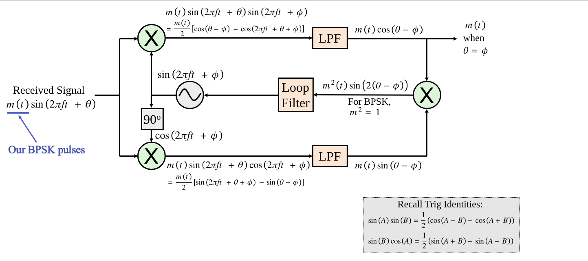
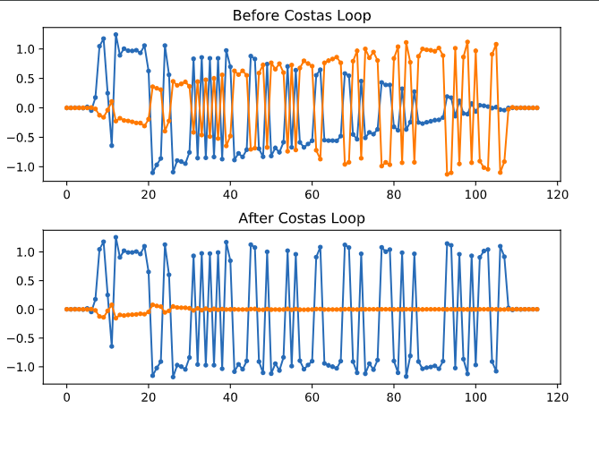

# Costas-Loop
A Costas Loop is a special type of Phase-Locked Loop (PLL) used for carrier recovery in digital communication systems.
--
👉 It removes carrier frequency and phase offset from modulated signals such as:

- **BPSK**
- **QPSK**
- **QAM**
- # 🎯 Why Do We Need a Costas Loop?

When a signal is transmitted:
`s(t) = m(t) cos(2π f_c t)`

At the receiver, due to oscillator mismatch:
`r(t) = m(t) cos(2π (f_c + Δf) t + ϕ)`

---

## Where:

- `Δf` → Frequency offset  
- `ϕ`  → Phase offset  

---

## 🚨 Without Correction:

- Constellation rotates  
- Bit errors increase  
- Demodulation fails  

---

👉 The **Costas Loop** locks onto the carrier and removes this frequency and phase offset.
---

## 📊 Costas Loop Block Diagram

# 🧠 Working Principle (For BPSK)

## Step 1: Mix Received Signal with Local Oscillator

Generate:
`I = r(t) cos(θ̂)`  
`Q = r(t) sin(θ̂)`

Where:

- `r(t)` = Received signal  
- `θ̂` = Estimated carrier phase from VCO/NCO  
- `I` = In-phase component  
- `Q` = Quadrature component
## Step 2: Phase Error Detection

For BPSK, the error signal is:
`e[n] = I[n] * Q[n]`

---

### Why?

If phase is correct:

- `Q ≈ 0`
- `Error ≈ 0`

If phase is wrong:

- `Q ≠ 0`
- Error pushes the loop to correct the phase
## Step 3: Loop Filter (PI Controller)

theta[n+1] = theta[n] + Kp * e[n] + Ki * sum(e[n])

Where:

- `Kp` = Proportional gain  
- `Ki` = Integral gain  
- `e[n]` = Phase error signal  

This updates the NCO phase.
## 📊 Constellation Behavior in Costas Loop

### 🔴 Before Lock
- Constellation continuously rotates  
- Points are not aligned with the real axis  
- High probability of bit errors  

### 🟢 After Lock
- BPSK symbols align on the ±1 axis  
- Q component ≈ 0  
- Stable demodulation achieved
- 
## 📊 IQ SamplesDiagram  in Time Domain

## 📊 Constellation Diagram of Costas Loop After Lock

